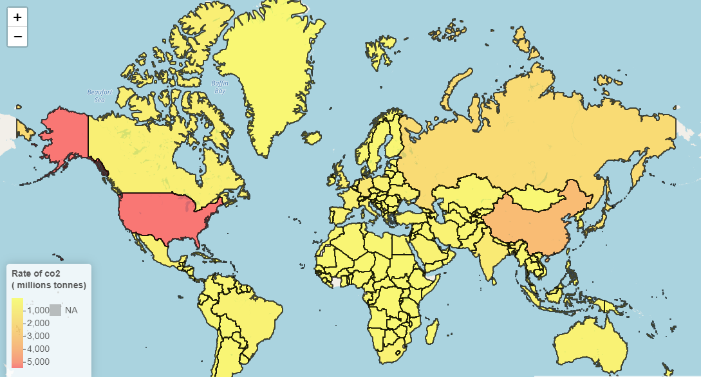
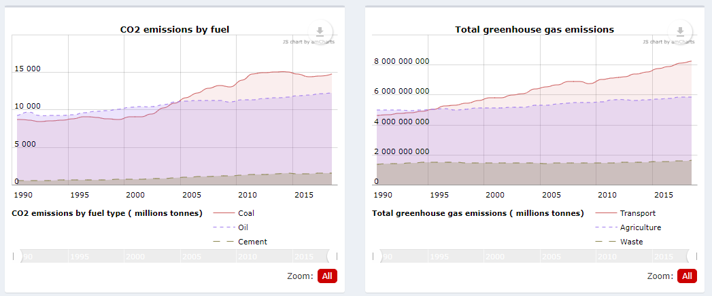
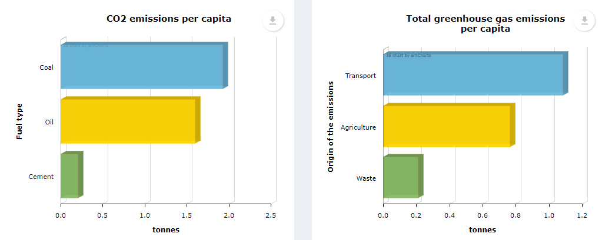
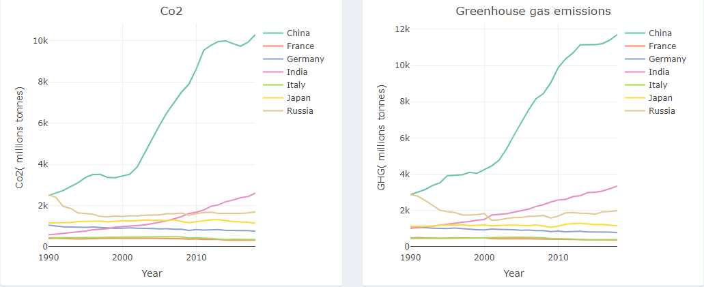
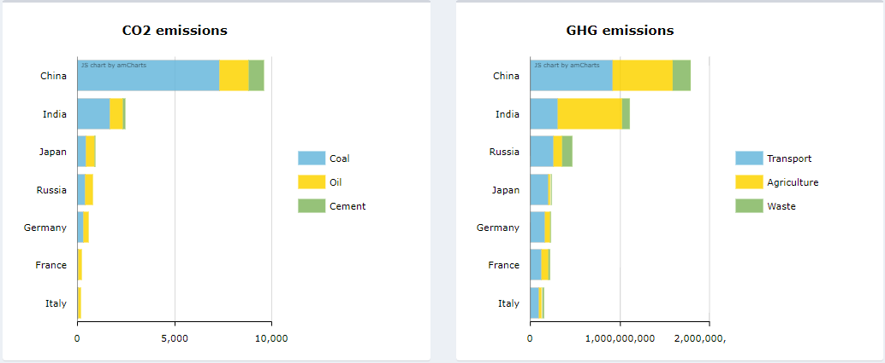

  
  # Projet R Shiny : Climate Change
  

Cette application web avec Shiny a été crée dans le cadre d'un projet du module de *Visualisation sous R* dispensé en Master 1 Mathématiques Appliquées, Statistiques à l'Université de Rennes 2.  
Nous avons fait le choix de mettre son contenu en anglais.

## Lien de l'application : [**Climate Change with Shiny**](https://ndhennin.shinyapps.io/climate2/)

## Présentation

Aujourd'hui, il est nécessaire de comprendre comment le climat est en train de se transformer et des répercussions qu'il peut engendrer. Les gaz à effet de serre (GES) sont responsables du réchauffement climatique et affectent déjà notre monde actuel.
Conscients que ce problème est très urgent et important, nous avons construit l'application R Shiny pour visualiser les émissions causées par l'Homme, permettant ainsi d'évaluer le processus de limitation des gaz à effet de serre de chaque nation.

## Onglets de l’application R Shiny
Notre application R Shiny se compose de quatre sections principales :
- Introduction aux sujets et au contenu de l'application
- Carte du monde
- Statistiques 
  - Graphiques de CO2 et de GES par secteur
  - Comparaisons par pays
- Tables des données utilisées

## Carte du monde
Apparaît dans cette section une carte des pays du monde entier, ici se présentent deux options : sélectionner l'année et sélectionner les émissions à observer.
La couleur des pays changera selon ces deux options, représentant le niveau d'émissions de chaque pays.
Nous nous concentrons sur les trois principaux gaz à effet de serre, CO2, N2O et méthane de chaque pays, ainsi que le total de ces trois gaz.

## Statistiques

### CO2 and GHG

#### **Graphiques**

  

#### **Sélection des inputs**

- *Choose CO2 Origin*

Lors de la sélection des catégories de CO2, l'application fournit des changements sur les deux graphiques sur la gauche des observations. Le line-graph nous permet de suivre les émissions du pays d'une année à l'autre des catégories sélectionnées. Le graphique à barres permet d’observer les émissions de CO2, mais par habitant de l'année sélectionnée.

- *Choose GHG cause*

Lors de la sélection des secteurs des émissions de gaz à effet de serre (GES), l'application fournit des changements sur les deux graphiques à droite représentant les gaz à effet de serre totaux par secteur, avec une fonctionnalité similaire à celle du CO2.

- *Countries*

Lors de la sélection du pays, les quatre graphiques seront mis à jour en fonction des données du pays (origines de ses émissions de CO2, ses émissions de gaz à effet de serre par secteur, ainsi que par habitant pour l’année prédéfinie).

- *Year*

Lors de la sélection de l’année, seuls les graphiques en barres changeront, car ces données sont fournies à l’année sélectionnée.
Pour les deux autres graphiques en haut, représentant les émissions de CO2 et de gaz à effet de serre par secteur, le choix de la période à observer se fait à l’aide du menu glissant de ce graphique directement afin d’observer les émissions sur toute une période.

### Comparaison

Cette section nous permet de comparer deux ou plusieurs pays, ce qui permet d'observer leurs progrès ou non en matière de réduction des émissions. Nous fournissons de nombreuses comparaisons telles que les types de CO2 et les sources de GES. Le choix des inputs est similaire à ceux de la sous-partie *CO2 and GHG* afin de comparer les émissions entre pays.

 

## Données utilisées

Nous utilisons les données de Our World In Data et de Climate Watch Data. Dans ce qui suit, nous présenterons les trois tables de données nettoyées:

- Table co2data : [Our World In Data](https://github.com/owid/co2-data).
Cette table représente les données annuelles par pays et par habitant du CO2 émis avec aussi l’origine de ces émissions (par exemple la combustion d’énergie fossile), couvrant 205 pays, de 1949 à 2020. Il est aussi noté l’émission des autres gaz à effet de serre tels que le méthane et l'azote en millions de tonnes.

- Table ghgdata : [ICOS](https://www.icos-cp.eu/science-and-impact/global-carbon-budget/2021).
Cette table représente les données annuelles des émissions de gaz à effet de serre par secteur, couvrant 200 pays, de 1990 à 2018.

- Table ghg_capdata : [The Climate Watch Data](https://www.climatewatchdata.org/data-explorer/historical-emissions?historical-emissions-data-sources=cait&historical-emissions-gases=all-ghg&historical-emissions-regions=All%20Selected&historical-emissions-sectors=total-including-lucf%2Ctotal-including-lucf&page=1).
Cette table représente les données annuelles des émissions de gaz à effet de serre par secteur et par habitant, couvrant 200 pays, de 1990 à 2018.

## Conclusion

L'application fournit une vue complète des origines des gaz à effet de serre par pays suivant les années. Tous les gaz provenant du comportement humain sont enregistrés, par exemple la combustion du charbon, du ciment, la combustion des terres ou des forêts, le gaz industriel, etc.
Nous nous rendons compte que la tendance des émissions dans le monde est toujours à la hausse depuis les années 1990. Cependant, il y a un point positif car depuis 2010 environ, la croissance n'est pas aussi forte qu'avant (le graphique à ce stade ressemble presque à une ligne horizontale stable).
Plus en détail, alors que quelques pays émettent encore de plus en plus de gaz, certains ont fait un excellent travail en matière de protection de l'environnement comme la France, l'Allemagne, l'Italie ou encore le Japon dont les mesures pour limiter les émissions ont eu des résultats évidents.

## Auteurs de l'application

[NGUYEN Manh Hung](https://github.com/nmh4598) \| [DHENNIN Nolwenn](https://github.com/ndhennin) \| PHAM Thi Minh Ngoc
